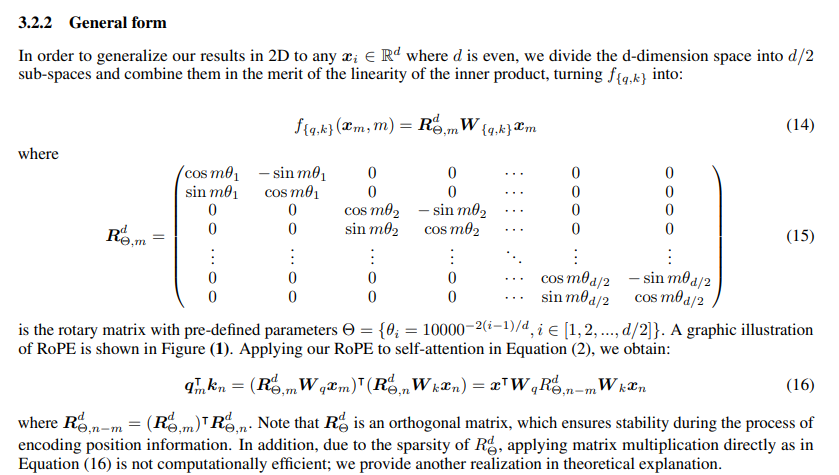
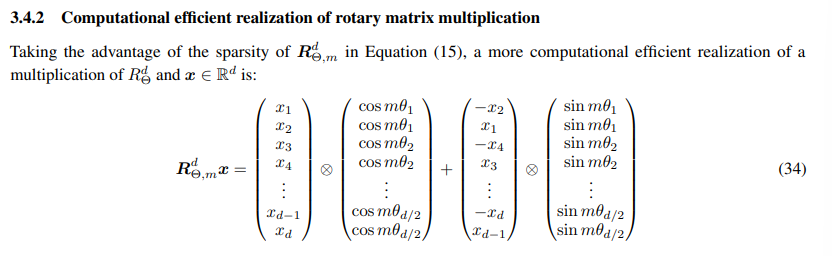
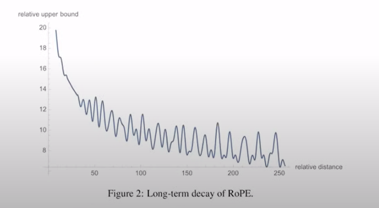

# Coding Vision Language Model from Scratch


Like my previous implementation, this repo is a code follow-along excercise by the [excellent tutorial](https://www.youtube.com/watch?v=vAmKB7iPkWw) by Umar Jamil `@hkproj`. 

``` bash
The code covers
- Vision Transformer
- Contrastive Learning (CLIP and SigLIP)
- Language Model (Gemma)
- KV Cache
- Rotary Positional Encoding (RoPE)
- Normalization (Batch, Layer, RMS)
```


## Why PaliGemma
* PaliGemma achieves state-of-the-art results across various vision-language tasks, including image captioning, visual question answering (VQA), and specialized tasks like chart understanding and optical character recognition (OCR) [reference](https://syncedreview.com/2024/07/26/from-images-to-insights-deepminds-versatile-vision-language-model-paligemma-achieves-sota-results/). 
* Plaigemma also has few-show learning capabilities.
* Only 3B params - fairly lightweight!


## Advantages over CLIP

| Feature                | PaliGemma                                    | CLIP                                      |
|------------------------|:--------------------------------------------:|:------------------------------------------:|
|**Image Encoder**       | SigLIP                                       | Jointly trained image encoder             |
|**Text Decoder**        | Gemma                                        | No dedicated text decoder                 |
| **Loss Function!!**      | **Sigmoid <br>(computationally cheaper)**   | **Softmax cross-entropy  <br>(more resource-intensive)** |
| **Output Types**       | Text outputs from images	                    | Generates embeddings                      |
| **Task Performance**   | Strong in object detection and segmentation  | Excels in zero-shot classification, not detection?!         |
| **Open Source**        | Yes                                          | No                                        |                
| **Training Datasets**  | vision-language datasets                     | image-text pairs                          |

> Directly training in contrastive fashion is better because we can download billions of images from the internet. Mostly, images are captioned, like the alt_text atleast :)

## CLIP Basics
Loss is the average loss over rows and columns (`axis=0` and `axis=1`). Because the matrix is not symmetric. Like $I_1 \cdot T_0 \neq T_1 \cdot I_0 $


But the softmax function (loss when calculating over every row and column) is *numerically unstable*. We have to multiply by this constant to make it stable. \
This will have to be done for every row every column. Plus, the usual exponentials, sum of all exponentials etc. **Too much computation** \
Even while parallelising, we have to keep a full row or full col in a memory. So have to keep batch size less


**Solution - Sigmoid loss!**

Don't worry about each row and each col. Instead, treat it as a binary classification task. Over each item in the all-dot-products matrix. 

Independently over all other items. Much more parallelisable! No need for normalization constants.

Labels for each item will be either 1 (if on diagonal) or 0 (if off diagonal).


## Vision Transformer
It is a **seq-to-seq** model. 

> **Input** -> collection of embeddings. For 16 patches, we have 16 embeddings (obtained by convolution over that patch). Each patch's embedding only has info about its pixels. (*ofc*)

> **Output** -> Contextualized embeddings i.e. series of embeddings that has patch info + position info + info about context 


Difference from the usual language models
-  Positional embeddings are not sinusoids here. They are learnable ones. 
- In language models, contextual embeddings are created by causal masking i.e. attention uses causal mask. The output embeddings in vision are not masked in any way. Image patches should have knowledge about nearby patches no probs :D Images aren't autoregressive.


## Normalization 101
Main reason - **covariate shift**. 

One batch of inputs, say values range (1-10) will give next layer outputs in similar range (assuming weights are 0-1). Say next batch of inputs ranges in (100-200), then outputs also shoot up.

$\implies$ Big change in loss while training
$\implies$ Big change in gradient
$\implies$ Big change in weights training
$\implies$ Slow training

### Solution 1: **Batch Normalization** 
We calulate statistics along each dimension of the vector representing an item. For this to work well, usually need a large batch size, so that the $\mu, \sigma$ for each dim stabalise enough a lot of samples. But still faster than earlier. 


### Solution2: **Layer Normalization** 
Calculate the statistics along each row, makes training more stable, because don't need large batch size now. 


### Solution3: **RMS Normalization** 
They say only variance is important. Mean is not that important. So we want most of the values to be around whatever the mean it is.

Faster than Batch and Layer norm because we don't need to calculate mean. But to calculate variance, we need the mean. Instead we calculate the RMS statistic inplace of std dev. Gamma parameter is learnable. 


## Encoders
Remember, encoders (like BERT) are seq-to-seq models. For each input, you get an embedding. 
> Implemented in the `class SiglipEncoderLayer` in `modelling_siglip.py`<br> 


```
Note the two major objectives of multi-head attention
1. All the heads run in parallel. 
2. Each head learns to relate tokens/patches differently
```

Now that we have a collection of contextualized embeddings for each image, we can take the mean to get a single embedding. For language tasks, models like `CLIP` took the embedding of the `CLS` token as a representative of the whole sentence. 


## Tokenizer ([official repo](https://github.com/google-research/big_vision/tree/main/big_vision/configs/proj/paligemma#tokenizer)). Also read [Detailed Inference Process](https://huggingface.co/blog/paligemma#detailed-inference-process)
PaliGemma uses the Gemma tokenizer with 256'000 tokens, but we **further extend its vocabulary** with 1024 entries that represent coordinates in normalized image-space (<loc0000>...<loc1023>), and another with 128 entries (<seg000>...<seg127>) that are codewords used by a lightweight referring-expression segmentation vector-quantized variational auto-encoder (VQ-VAE) with the architecture of Ning et al. (2023) and trained on OpenImages as in PaLI-3. While the big_vision codebase is flexible enough to extend tokenizers on-the-fly, we also provide a SentencePiece model file of the Gemma tokenizer with these additional tokens baked in, for the convenience of other codebases.


> The input text is tokenized normally, and a `<bos>` token is added at the beginning, and an additional newline token `\n` is appended. The tokenized text is also prefixed with a fixed number of `<image>` tokens. The model uses full block attention for the **complete input `(image + <bos> + prompt + \n)`**, and a causal attention mask for the generated text.


Gemma tokenizer will ofcourse generate tokens for the text. But we also need tokens for the image. So we insert some placeholder tokens `<image>` that will then be replaced with the embeddings extracted by the Vision Encoder. 


We are using the [paligemma-3b-pt-224](https://huggingface.co/google/paligemma-3b-pt-224) model. Pre-trained with `224*224 input images` and `128 token input/output text` sequences.


Paper says '\n' token be tokenized seperately. But HF implementation does not! 


## Weight Tieing
Technique to reuse params of one layer to another in LLMs (Decoder only part :D). Since the last linear layer and the initial layer perform reverse functions, their weights cab be reused for efficiency i.e. will have to work with less number of parameters.


## Transformers 
**Bottom line - transformers are seq2seq models**. *For each input, you get one output. For 100 inputs, you get 100 outputs.*

> For simplicity we assume that each word is a token

### **Training Time**

Given a sentence "I love Italian pizza", we generate 4 training samples for Next token prediction task.

| Timestep      | Input                     | Transformer Input                                         | Transformer Output                                                                        | Target    |
|:-------------:|:--------------------------|-------------------                                        |-----------------------                                                                    | :-------------------|
|**1**          | I                         |`<embed(I)>`                                               |`<contextual about I>*`                                                                     | love                |
|**1**          | I love                    |`<embed(I)>` <br> `<embed(love)>`                          |`<contextual about I>` <br> `<contextual about love>*`                                      | Italian             |
|**1**          | I love Italian            |`<embed(I)>` <br> `<embed(love)>` <br> `<embed(Italian)>`  |`<contextual about I>` <br> `<contextual about love>`  <br> `<contextual about Italian>*`   | pizza               |
|**1**          | I love Italian pizza      |`<embed(I)>` <br> `<embed(love)>` <br> `<embed(Italian)>` <br> `<embed(pizza)>`  |`<contextual about I>` <br> `<contextual about love>`  <br> `<contextual about Italian>` <br> `<contextual about pizza>*`  | EOS               |


Suppose training sentence = "I love"  <br>
- Tokenization ->  ["I", "love"]  <br>
- Embedding + Posn info for each token <br>
- **Transformer outputs: Contextual embeddings for each input token. So two contextual embeddings**
    -   **One for "I", which only has information about "I"**
    -   **One for "love", which has information about both "I" and "love"**

- Linear + Softmax: Each contextual embeds is passed through Linear (get logits) and softmax (get probablity distribution). 
- **Loss: CE Loss between the output probability distribution for the "love" token against the actual next token "Italian"**


Each sample progressively includes more context, allowing the model to learn from varying lengths of input sequences. For loss calculation, we take the `*` marked contextual embeds.


### **Inference Time**
Here is how we want LLM to work

| Timestep          | Input                           | Output                          |
|-----------|--------------------------------|-------------------------------|
|**1**              | I                          | love Italian pizza                   |


But actually it works like similar to training, except the timesteps. 

| Timestep      | Input                     | Transformer Input                                         | Transformer Output                                                                        | Model Prediction    |
|:-------------:|:--------------------------|-------------------                                        |-----------------------                                                                    | :-------------------|
|**1**          | I                         |`<embed(I)>`                                               |`<contextual about I>*`                                                                     | love                |
|**2**          | I love                    |`<embed(I)>` <br> `<embed(love)>`                          |`<contextual about I>` <br> `<contextual about love>*`                                      | Italian             |
|**3**          | I love Italian            |`<embed(I)>` <br> `<embed(love)>` <br> `<embed(Italian)>`  |`<contextual about I>` <br> `<contextual about love>`  <br> `<contextual about Italian>*`   | pizza               |


For next token prediction, we take the `*` marked contextual embeds, and project it to the linear layer, softmax etc to get a new token!


## KV Cache
As seen above, the issue with the seq2seq nature of transformers is that we repeatedly compute unncessary contexual embeds. We only need the last contextual embeddings for next token prediction. Don't care about earlier ones because we already computed thier corresponding next token. 

We want to avoid repeated computation and therefore imporve efficiency. 

> Note: This image is taken from the Llama2-from-scratch series. **We need the  final `Q` row, whole of `K` and `V`**. So we can pass individual `Q`(!!) and keep a cache of all previous `K` and `V`


| Timestep      | Input `(Q)`               | Transformer Input     | KV Cache                                  | Transformer Output             | Model Prediction    |
|:-------------:|:--------------------------|------------------     |-                                          |-----------------------         | :-------------------|
|**1**          | I                         |`<embed(I)>`           | K:`[]` <br> V:`[]`                        |`<contextual about I>*`         | love                |
|**2**          | love                      |`<embed(love)>`        | K:`["I"]` <br> V:`["I"]`                  |`<contextual about love>*`      | Italian             |
|**3**          | Italian                   |`<embed(Italian)>`     | K:`["I", "love"]` <br> V:`["I", "love"]`  |`<contextual about Italian>*`   | pizza               |


## Prefilling of KV Cache
When the user input is long, say "I love Italian", we ofcourse start with an empty KV Cache, but going the usual way will fill the cache one by one - slow!

Better way is to pass the entire input to the model at once (like last step of Inference table above). This way, we'll have copies of `K`, `V` for each input token which we simply add in the cache.
We get multiple outputs (because of big input and one output per input seq2seq) - start decoding from the last contextual embed as usual.


## Masking in Paligemma
The figure in the Tokenizer heading above shows masking. The paligemma authors chose to NOT use causal masking for the prompt text. Only the output text (the one being generated) is being causal-masked
> Usually the prompt text is quite small so it is okay?

Even while generating new text, we do **NOT** put causal mask. The masking figure shows how generated tokens need access to all image and prompt text. A new generated token anyways needs access to previously generated token!

Masking is done as $ softmax(\dfrac{Q \cdot K^{T}}{\sqrt{d_{head}}} + \textrm{MASK}) $

I.e. We are adding the mask before softmax. If we keep -inf in mask, softmax will reduce it to 0 as usual.


## Gemma Model


## Issue with usual MHA
Multi-query attention paper mentions that the bottleneck is not the number of computations, instead it is the number and time taken of transfers between GPU. <br>
**FlashAttention** exploits this differences in memory transfer. We are willing to sacrifice compute to reduce the data transfers. Similarly is the idea of **Gradient Checkpointing** where we save gradients periodically. 


A possible way to reduce data transfers is to have less heads for the keys. 


A major advantage of the grouped query attention is to have lesser size of the KV Cache. Storing the KV Cache for larger models is a major issue many times. 


## RoPE
RoPE is from the family of relative embeddings. The dot product should only depend on the embedding of the first token, embedding of second token and their relative position. 


The paper starts from the 2D case about how to write the function as a matrix multiplication. **Multiplying the rightmost vector $[x^{(1)}_{m}, x^{(2)}_{m}]$ by the $W$ and rotation matrices ENCODES info such that, when we will further take dot product of these encoded vectors, the result will be a function of both embeddings and the relative position.**


Then extend it to generic case, but the rotation matrix is sparse. Hence, a direct matrix multiplication will be inefficient. Note the pre-defined parameters
$$
\Theta = \{ \theta_{i} = 10000^{-2(i-1)/d}, i \in [1,2, \cdots d/2] \}
$$


The efficient way suggested is - 


The paper also tells how with more relative distance, the association decreases. 


Visual representation of RoPE. Information is encoded in pairs. We multiply by $\theta$, but also include a factor of the position $m$  


## Effect of Temperature
We divide the logits by the temperature, before applying softmax. More temperature means we divide by larger number and therefore, the logits values are scaled down. Enables the model to sample more diverse tokens. 

## Top p sampling
*Assume top-p is set as 0.8* <br>
Once we get outputs after softmax for the next tokens, we arrange them in decreasing order. And move forward with the top tokens such that their cumulative score is at max 0.8. From this selection, we can perform a weighted sampling i.e. rearrange these numbers such that their scores sum to 1 and sample from them. 


