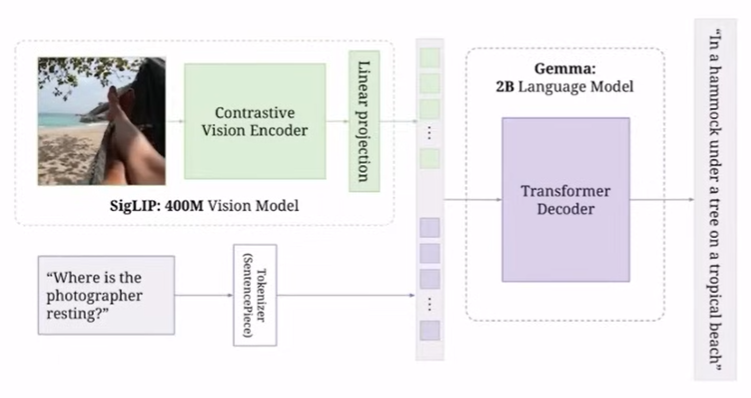
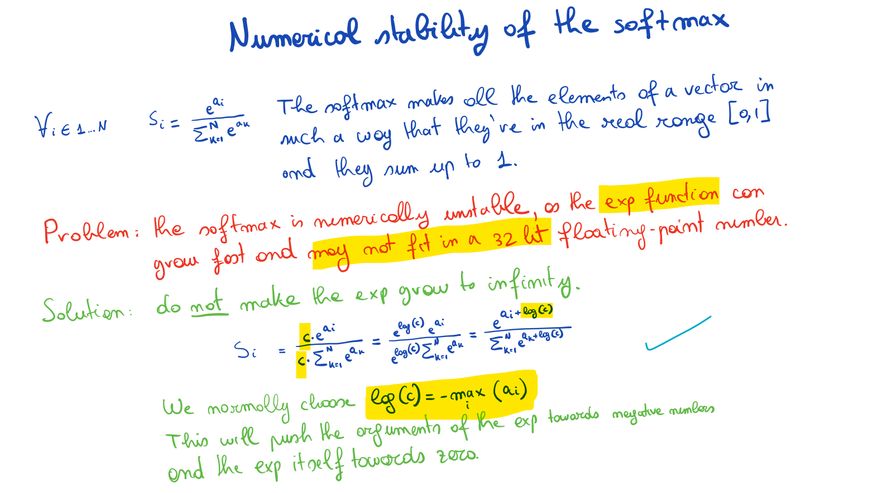
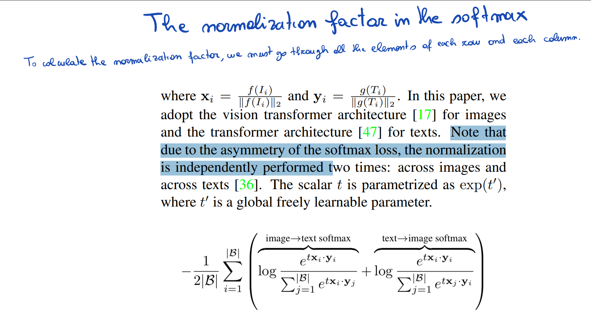
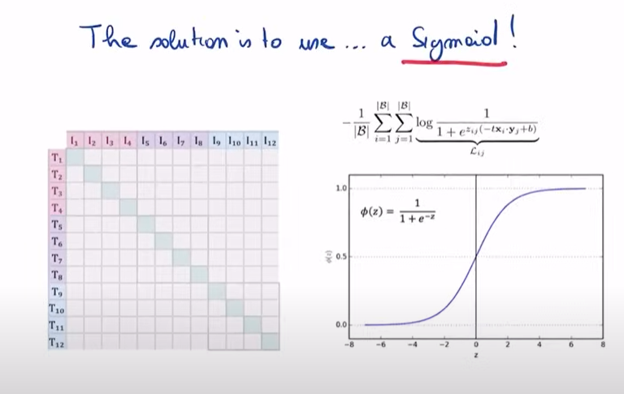

# Coding Vision Language Model from Scratch


Like my previous implementation, this repo is a code follow-along excercise by the [excellent tutorial](https://www.youtube.com/watch?v=vAmKB7iPkWw) by Umar Jamil `@hkproj`. 

``` bash
The code covers
- Vision Transformer
- Contrastive Learning (CLIP and SigLIP)
- Language Model (Gemma)
- KV Cache
- Rotary Positional Encoding (RoPE)
- Normalization (Batch, Layer, RMS)
```



## Why PaliGemma
* PaliGemma achieves state-of-the-art results across various vision-language tasks, including image captioning, visual question answering (VQA), and specialized tasks like chart understanding and optical character recognition (OCR) [reference](https://syncedreview.com/2024/07/26/from-images-to-insights-deepminds-versatile-vision-language-model-paligemma-achieves-sota-results/). 
* Plaigemma also has few-show learning capabilities.
* Only 3B params - fairly lightweight!


## Advantages over CLIP

| Feature                | PaliGemma                                    | CLIP                                      |
|------------------------|:--------------------------------------------:|:------------------------------------------:|
|**Image Encoder**       | SigLIP                                       | Jointly trained image encoder             |
|**Text Decoder**        | Gemma                                        | No dedicated text decoder                 |
| **Loss Function!!**      | **Sigmoid <br>(computationally cheaper)**   | **Softmax cross-entropy  <br>(more resource-intensive)** |
| **Output Types**       | Text outputs from images	                    | Generates embeddings                      |
| **Task Performance**   | Strong in object detection and segmentation  | Excels in zero-shot classification, not detection?!         |
| **Open Source**        | Yes                                          | No                                        |                
| **Training Datasets**  | vision-language datasets                     | image-text pairs                          |


## CLIP Basics
Loss is the average loss over rows and columns (`axis=0` and `axis=1`). Because the matrix is not symmetric. Like $I_1 \cdot T_0 \neq T_1 \cdot I_0 $


But the softmax function (loss when calculating over every row and column) is *numerically unstable*. We have to multiply by this constant to make it stable. \
This will have to be done for every row every column. Plus, the usual exponentials, sum of all exponentials etc. **Too much computation** \
Even while parallelising, we have to keep a full row or full col in a memory. So have to keep batch size less




**Solution - Sigmoid loss!**

Don't worry about each row and each col. Instead, treat it as a binary classification task. Over each item in the all-dot-products matrix. 

Independently over all other items. Much more parallelisable! 

Labels for each item will be either 1 (if on diagonal) or 0 (if off diagonal).
